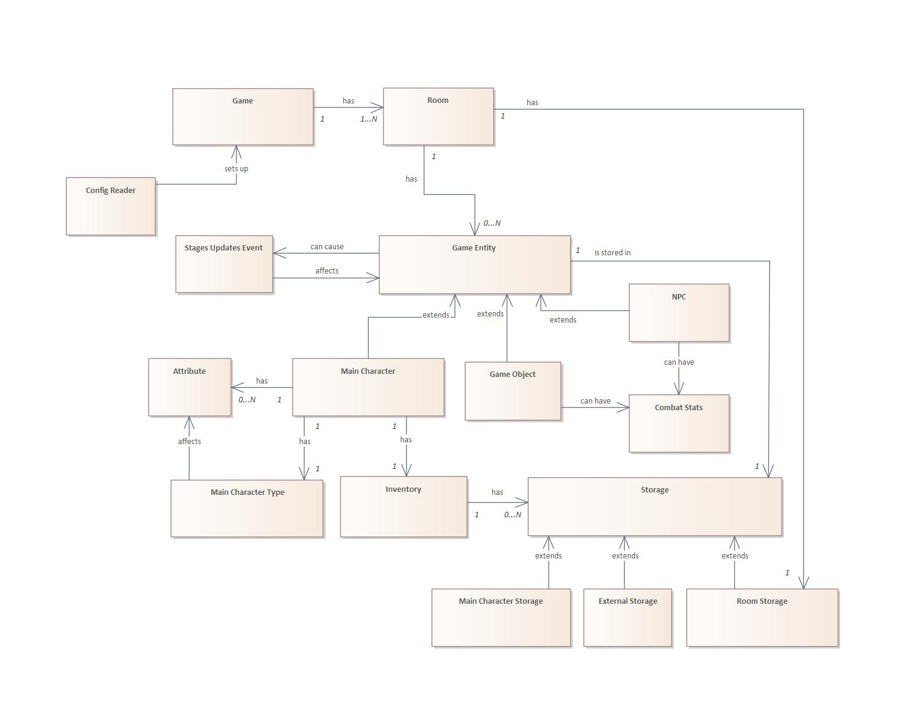

# Adventure Engine

---

A flexible, C++ based, engine for creating text-based adventures and RGP games. Featuring customizable character creation, inventory and storage systems, turn-based combat, save/load functionality and more. Games are configured using JSON files.

---

## Running the Engine, Games, Tests, and Doxygen

You can easily run the Adventure Engine using the provided `Makefile`.

### Running the Engine
1. Navigate to the root project directory.
2. Compile the project by running:
   ```sh
   make
   ```
   This will generate the `run-adventure-engine` executable.
3. To start a game, execute the following command, replacing `<game_name>` with the desired game:
   ```sh
   ./run-adventure-engine <game_name>
   ```
   For example, to run the included example games:
   ```sh
   ./run-adventure-engine exampleGame
   ./run-adventure-engine exampleGameSK
   ```

### Running Tests
To run the test suite, simply execute:
```sh
make test
```

### Generating Documentation
You can generate a full HTML documentation of the project using Doxygen by running:
```sh
make doc
```
The generated documentation will be available in the `doc` directory, with the `index.html` file being its root.

## Class Diagram



## Character creation

When the player starts a game made in AdventureEngine, they first make choices that will affect their character.

Firstly, the game displays information about the possible types of the main character. The player then chooses one. For example "warrior" or "intellectual".

Secondly, the game shows a list of attributes. Each of them is set to 100% by default. However, the player then has a chance to increase these values by N percentage points. For example, in a game with N=20 and three attributes - health, power, intelligence - the player could choose values 110%, 104%, 106%.

When the player performs an action in the game, the game can respond differently to the same action depending on the player's attributes. If the player meets the required attributes the game prints the main text response, otherwise it prints an alternative one. Attributes are influenced by both the player's choice of the percentages and by the chosen Type.

## InventoryStorage/Storage system

The main character has an inventory. It is implemented as a set of `Storage` objects. Besides the standard "Main character storage" (their hands, pockets), the `InventoryStorage` can contain "External storages" like bags, backpacks etc. The game also includes `Room` Storages - one for each room - these are unrelated to `InventoryStorage`.

Each `Storage` has a limited capacity. The player can take and remove items from/to `InventoryStorage`.

## Combat system

The engine features non-playable characters and a combat system. If an `NPC` is "fightable", then the player can attack it. The player can have Objects in their two hands. If an object is a weapon and it's in a hand, it can be used for combat.

The weapon (or no weapon) that will be used for the combat is determined by the engine once the player wants to start combat. It calculates the power of the possible weapon in the left/right hand and the power of using no weapon, and then chooses the most effective option.

The player can add or remove objects from their two hands before combat to get ready, however (Currently not implemented.)

## Saving / Loading

The player can both save the game and load a save-file. The engine currently supports the saving/loading of:

- the current room
- the Main Character's attributes values
- the Main Character's Type

## Configuration

The game creator creates a game using JSON configuration files.

Each game is in a separate directory in `./example`. Each game's root directory must include:

- 3 `.json` files:
  - `commands.json`
  - `types-and-attributes.json`
  - `game-setup.json`
- and 4 subdirectories: `/events`, `/rooms`, `/inventory`, `/saves`

The game creator can get inspired by the working example games in the `./example` directory. The keys and values must follow the same syntax as these example files. The key strings contain hints and explanations on how they work.

The engine is not limited to supporting only the English language. Games can be created in any language – see `exampleGameSK` for a game in Slovak.

## Inheritance & Polymorphism

### Inheritance:

- `Storage` is the parent class of:
  - Main Character `Storage`
  - External `Storage`
  - `Room` `Storage`
- `GameEntity` is the parent class of:
  - `GameObject`
  - `MainCharacter`
  - `NPC`

### Polymorphism:

- One of the most important containers of this project is the map called "entities" in `Game` class.
  - `std::unordered_map<std::string, std::shared_ptr<GameEntity>> entities`
  - it maps names and synonym names (`std::string`) to `GameEntity` objects.
  - `Game` class further includes methods for manipulation with the map:
    - `std::shared_ptr<GameEntity> Game::findEntity(const std::string& noun) const`
    - `bool Game::addNamesToEntityMap(const std::vector<std::string>& names, GameEntity& entity)`
    - `void Game::removeEntityFromMap(GameEntity& entityToBeRemoved)`
- `InventoryStorage` contains Storages (one `InventoryStorage` and O...N ExternalStorages)
  - Its methods using Polymorphism, therefore using the `Storage` class include:
    - `bool addExternalStorage(Storage& storage);`
    - `bool removeStorage(const Storage& storage);`
    - `bool addObject(std::shared_ptr<GameObject> object, Storage& storage);`
    - `bool removeOneObject(std::shared_ptr<GameObject> object, Storage& storage);`
    - `bool removeAllObjects(std::shared_ptr<GameObject> object, Storage& storage);`
    - `const std::vector<std::unique_ptr<ExternalStorage>>& getExternalStorages() const;`
- Finding out how many (if any) instances of an entity are in `Storage` uses polymorphism:
  - `unsigned int getEntityCount(const GameEntity& object) const`
  - This method gets called when the player enters the Verb/Noun pair. At that point we don't know what type of `GameEntity` the Noun could refer to, so the `GameEntity` parent class is used in the method.
